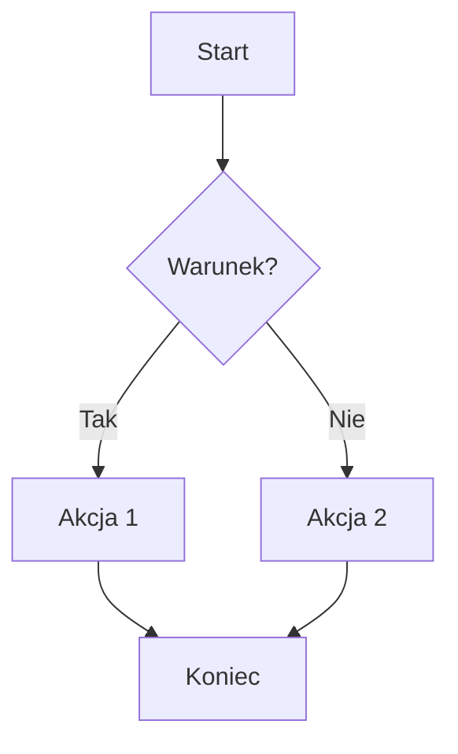
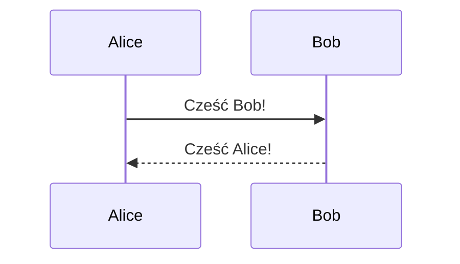

# 📝 Markdown Syntax Cheat Sheet

---

## 1. NAGŁÓWKI (Headings)

# Nagłówek H1

## Nagłówek H2

### Nagłówek H3

#### Nagłówek H4

##### Nagłówek H5

###### Nagłówek H6

Alternatywna składnia (tylko H1 i H2):

# Nagłówek H1

## Nagłówek H2

---

## 2. FORMATOWANIE TEKSTU (Text Formatting)

**Pogrubienie** lub **Pogrubienie**

_Kursywa_ lub _Kursywa_

**_Pogrubiona kursywa_** lub **_Pogrubiona kursywa_**

~~Przekreślenie~~

`Kod inline`

<u>Podkreślenie (HTML)</u>

<mark>Zaznaczenie / highlight (HTML)</mark>

Indeks dolny: H<sub>2</sub>O

Indeks górny: x<sup>2</sup>

---

## 3. AKAPITY I ŁAMANIE LINII (Paragraphs & Line Breaks)

To jest pierwszy akapit. Akapity oddzielamy pustą linią.

To jest drugi akapit.

Wymuszony podział linii — dwie spacje na końcu linii:  
Druga linia po przełamaniu.

Lub użyj `<br>`:
Pierwsza linia<br>Druga linia

---

## 4. CYTATY (Blockquotes)

> To jest cytat.

> Cytat pierwszego poziomu.
>
> > Zagnieżdżony cytat.
> >
> > > Potrójne zagnieżdżenie.

> **Cytat z formatowaniem:**
>
> - punkt listy
> - kolejny punkt

---

## 5. LISTY (Lists)

### Lista nieuporządkowana

- Element A
- Element B
  - Zagnieżdżony element B1
  - Zagnieżdżony element B2
    - Głębiej zagnieżdżony
- Element C

* Alternatywny znacznik gwiazdka
* Kolejny element

- Alternatywny znacznik plus
- Kolejny element

### Lista uporządkowana

1. Pierwszy element
2. Drugi element
   1. Zagnieżdżony 2.1
   2. Zagnieżdżony 2.2
3. Trzeci element

### Lista zadań (Task List / GitHub Flavored Markdown)

- [x] Zadanie ukończone
- [ ] Zadanie do zrobienia
- [x] Kolejne wykonane zadanie
- [ ] ~~Zadanie anulowane~~

---

## 6. LINIA POZIOMA (Horizontal Rules)

---

---

---

---

---

---

## 7. LINKI (Links)

[Tekst linku](https://example.com)

[Tekst linku z tytułem](https://example.com "Tytuł linku")

[Link do sekcji w dokumencie](#nagłówki-headings)

<https://example.com>

<adres@email.com>

[Link referencyjny][ref1]

[ref1]: https://example.com "Opcjonalny tytuł"

[Skrócony link referencyjny][]

[Skrócony link referencyjny]: https://example.com

---

## 8. OBRAZY (Images)


[](https://example.com)

Obraz referencyjny:
![Alt text][logo]

[logo]: https://via.placeholder.com/150 "Logo"

---

## 9. KOD (Code)

### Inline

Użyj funkcji `print()` w Pythonie.

Kod z backtick wewnątrz: `` `kod` ``

### Blok kodu z ogrodzeniem (Fenced Code Block)

```
Zwykły blok kodu bez podświetlania składni
```

```python
# Python
def hello_world():
    print("Hello, World!")
    return True
```

```javascript
// JavaScript
const greet = (name) => {
  console.log(`Hello, ${name}!`);
};
```

```bash
# Bash
echo "Hello, World!"
ls -la /home
```

```sql
-- SQL
SELECT id, name, email
FROM users
WHERE active = 1
ORDER BY name ASC;
```

```json
{
  "name": "Jan Kowalski",
  "age": 30,
  "active": true
}
```

```html
<!DOCTYPE html>
<html lang="pl">
  <head>
    <title>Przykład</title>
  </head>
  <body>
    <p>Hello!</p>
  </body>
</html>
```

```css
/* CSS */
body {
  font-family: sans-serif;
  color: #333;
}
```

### Blok kodu z wcięciem (4 spacje)

    Ten tekst jest blokiem kodu
    dzięki wcięciu 4 spacji.

---

## 10. TABELE (Tables)

| Kolumna 1  | Kolumna 2  | Kolumna 3  |
| ---------- | ---------- | ---------- |
| Wartość A1 | Wartość B1 | Wartość C1 |
| Wartość A2 | Wartość B2 | Wartość C2 |
| Wartość A3 | Wartość B3 | Wartość C3 |

### Wyrównanie kolumn

| Lewo        |    Środek     |  Prawo |
| :---------- | :-----------: | -----: |
| L1          |      Ś1       |     P1 |
| L2          |      Ś2       |     P2 |
| Długi tekst | Środek tabeli | 999.99 |

---

## 11. PRZYPISY (Footnotes) — GFM / Extended

Tekst z przypisem[^1] i kolejnym przypisem[^note].

[^1]: Treść pierwszego przypisu.

[^note]: Treść przypisu z nazwą tekstową.

---

## 12. DEFINICJE (Definition Lists) — Extended

Termin
: Definicja terminu.

Markdown
: Lekki język znaczników do formatowania tekstu.
: Stworzony przez Johna Grubera w 2004 roku.

---

## 13. EMOJI

:smile: :rocket: :tada: :warning: :check:

Lub bezpośrednio: 🎉 🚀 ✅ ⚠️ 💡

---

## 14. UCIECZKA ZNAKÓW SPECJALNYCH (Escaping)

Znaki specjalne można uciec ukośnikiem `\`:

\*nie kursywa\*  
\*\*nie pogrubienie\*\*  
\# nie nagłówek  
\[nie link\]  
\`nie kod\`  
\\ ukośnik wsteczny  
\. \! \| \- \+ \= \{ \} \( \)

---

## 15. HTML INLINE

Markdown obsługuje surowy HTML:

<div style="color: red; font-weight: bold;">Czerwony pogrubiony tekst</div>

<details>
  <summary>Kliknij, aby rozwinąć</summary>
  Ukryta treść sekcji składanej (collapsible).
</details>

<kbd>Ctrl</kbd> + <kbd>C</kbd>

<center>Wyśrodkowany tekst (HTML)</center>

---

## 16. IDENTYFIKATORY NAGŁÓWKÓW (Heading IDs) — Extended

### Mój nagłówek {#moj-id}

Link do niego: [Przejdź do nagłówka](#moj-id)

---

## 17. PODKREŚLENIE / WSTAWIANIE — Extended (Critic Markup)

{==Zaznaczony tekst==}

{>>Komentarz<<}

{++Wstawiony tekst++}

{--Usunięty tekst--}

---

## 18. DIAGRAMY MERMAID — GFM / Extended





---

## 19. MATEMATYKA (Math / LaTeX) — Extended

Inline: $E = mc^2$

Blok:

$$
\int_{-\infty}^{\infty} e^{-x^2} dx = \sqrt{\pi}
$$

$$
\frac{d}{dx}\left(\int_{a}^{x} f(t)\,dt\right) = f(x)
$$

---

## 20. SKRÓTY (Abbreviations) — Extended

_[HTML]: HyperText Markup Language
_[CSS]: Cascading Style Sheets

Tekst zawierający HTML i CSS będzie miał automatyczne podpowiedzi.

---

## 21. METADANE (Front Matter / YAML) — Jekyll, Hugo, itp.

```yaml
---
title: "Tytuł dokumentu"
author: "Jan Kowalski"
date: 2024-01-15
tags: [markdown, dokumentacja, cheatsheet]
draft: false
---
```

---

## 22. DYREKTYWY / ADMONITIONS — Extended (MkDocs, Obsidian)

> [!NOTE]
> To jest notatka informacyjna.

> [!TIP]
> To jest wskazówka.

> [!WARNING]
> To jest ostrzeżenie.

> [!IMPORTANT]
> To jest ważna informacja.

> [!CAUTION]
> To wymaga ostrożności.

---

## 23. ZNAKI SPECJALNE — Encje HTML

&copy; — prawa autorskie  
&reg; — znak zastrzeżony  
&trade; — znak towarowy  
&amp; — ampersand &  
&lt; — mniejszy niż <  
&gt; — większy niż >  
&nbsp; — niełamliwa spacja  
&mdash; — myślnik em —  
&ndash; — myślnik en –  
&hellip; — wielokropek …  
&laquo; — « lewy cudzysłów  
&raquo; — » prawy cudzysłów

---

## 24. SZYBKA TABELA SKŁADNI

| Element          | Składnia                    |
| ---------------- | --------------------------- |
| H1               | `# Tekst`                   |
| H2               | `## Tekst`                  |
| Pogrubienie      | `**tekst**` lub `__tekst__` |
| Kursywa          | `*tekst*` lub `_tekst_`     |
| Pogrubiona kurs. | `***tekst***`               |
| Przekreślenie    | `~~tekst~~`                 |
| Kod inline       | `` `kod` ``                 |
| Blok kodu        | ` ``` ` kod ` ``` `         |
| Link             | `[tekst](url)`              |
| Obraz            | ``               |
| Cytat            | `> tekst`                   |
| Lista nieuporz.  | `- element`                 |
| Lista uporz.     | `1. element`                |
| Linia pozioma    | `---`                       |
| Tabela           | `\| kol1 \| kol2 \|`        |
| Task list        | `- [x] zrobione`            |
| Przypis          | `[^1]` + `[^1]: treść`      |

---

_Ściągawka Markdown — obejmuje CommonMark, GFM (GitHub Flavored Markdown) oraz popularne rozszerzenia._
